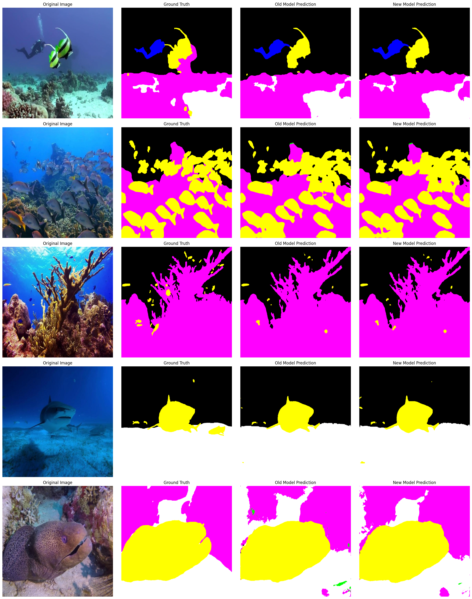

# SUIM Semantic Segmentation by UNet++

# 🌊 Underwater Imagery Semantic Segmentation (SUIM dataset)

This repository contains a semantic segmentation project focused on **underwater scene understanding** across **8 categories** using **UNet++** **(efficientnet-b4)**.

This project includes two model checkpoints:

- 30 Epochs vs 50 Epochs
- ✅ **Old Model:** Baseline performance with 30 epochs  
- ✅ **Final Model:** Improved version with better generalization, especially for small objects and reducing false positives.

---

## 🧭 Dataset Overview

The dataset includes pixel-level semantic annotations for the following 8 classes:

| Class ID | Class Name              |
|--------- | ---------------------- |
| 0        | Background (BW)          |
| 1        | Human divers (HD)        |
| 2        | Aquatic plants (PF)      |
| 3        | Wrecks/Ruins (WR)        |
| 4        | Robots (RO)              |
| 5        | Reefs/Invertebrates (RI) |
| 6        | Fish/Vertebrates (FV)    |
| 7        | Sea-floor/Rocks (SR)     |

Total train/val images: 1525 / Total test images: 110

Total train images: 1220 / Total val images: 305

✅ Created 80-20 split JSON for training and validation.

---

## 🏗️ Model Architecture

- 📍 Model: **U-Net++ with efficientnet-b4**
- 📍 Backbone: **"timm-efficientnet-b4"**
- 📍 Framework: **PyTorch + segmentation_models.pytorch (SMP)**
- 📍 Input Size: **512 × 512**
- 📍 Normalization: **ImageNet Mean/Std**

---

## 🔨 Augmentation Setup

For the **Final Model**, the selected augmentations have been carefully applied to improve generalization while avoiding object-missing issues:

```python
A.Compose([
        A.Resize(512, 512),
        # Geometric transforms
        A.HorizontalFlip(p=0.5),
        # Color and noise
        A.RandomBrightnessContrast(p=0.3),
        A.RandomGamma(p=0.3),
        A.GaussianBlur(p=0.2),
        # Normalize for ImageNet
        A.Normalize(mean=(0.485, 0.456, 0.406), std=(0.229, 0.224, 0.225)),
        ToTensorV2(transpose_mask=True),
])
```

---

## 📊 Final Test Performance

| Metric           | Old Model   | Final Model |
|----------------- | ---------- | ----------- |
| Test IoU (mIoU)  | 0.5271     | 0.5490      |
| Test Dice        | 0.5991     | 0.6308      |

### 📈 Per-Class IoU (Final Model)
```
Background          (BW): IoU = 0.9123
Human divers        (HD): IoU = 0.8299
Aquatic plants      (PF): IoU = 0.3706
Wrecks/Ruins        (WR): IoU = 0.7132
Robots              (RO): IoU = 0.7146
Reefs/Invertebrates (RI): IoU = 0.6631
Fish/Vertebrates    (FV): IoU = 0.8233
Sea-floor/Rocks     (SR): IoU = 0.6832
```

---

## 🎨 Visualization Samples

**Visual comparison tool** has been provided showing:

- Original Image and Ground Truth  
- Old Model Prediction vs. Final Model Prediction  

📌 Example:
  

The model outputs of **testing set** are visualized with:

- **Color-coded masks**
- **Overlay with Class name labels**  

📌 Example:
  

---

## 🚀 How to Run Inference
```python
visualize_comparison_two_models(
    data_loader=test_loader,
    old_model=oldmodel,
    new_model=model,
    num_images=5,
)
```

```python
# Show images from index 10 to 19 (total 10 images)
visualize_predictions_with_range(
    data_loader=test_loader,
    model=model,
    device=device,
    index_range=(10, 20),
    min_area=1000
)
```
---

## 🔑 Summary

✅ Better handling of small objects  
✅ Reduced false positives  
✅ More balanced class-wise performance  
✅ **Importance** Doesn't outperform top ranking models for SUIM  
✅ **Importance** Comparable results with previous baseline UNet on SUIM

---

## 📄 License

This project is intended for **academic research and educational use** only. Please cite **original dataset paper** or **appropriately to this repo** if used in publications.

---

## ⭐ Acknowledgements

- UNet++ powered by `segmentation_models.pytorch`
- Based on Popular semantic segmentation benchmarking dataset `SUIM`

---
